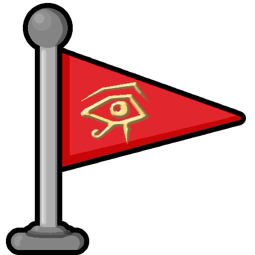
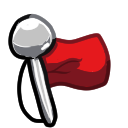

# Checkpoints

## Disclaimer

This package is in Beta and can be finicky to set up.

## Tile code

Use the tile code "checkpoint" to add a checkpoint to a level. ONLY ADD CHECKPOINTS ON THE FRONT LAYER.

## Setup

To avoid issues, activate the checkpoints when loading a level and deactivate when unloading:

```
dwelling.load_level = function()
  checkpoints.activate()
end

dwelling.unload_level = function()
  checkpoints.deactivate()
end
```

Not calling these methods can lead to other levels and transitions not loading properly.

Note: If the Checkpoints folder is renamed or is within a subfolder of your mod, it is required to set the directory to the path of the Checkpoints directory:

```
checkpoints.set_directory('Libraries/Checkpoints')
```

## Flag Images

Please use an image for the flags other than the ugly default flag! Thanks to Gugubo and Barm for contributing with nice checkpoint flags.

To change the style, use the `set_style` method.

There are currently three styles to choose from:

```
CHECKPOINT_STYLE = {
    DEFAULT_UGLY,
	EYE_OF_ANUBIS,
	FUNKY,
}
```

### Eye of Anubis



To use the Eye of Anubis style:

```
local CHECKPOINT_STYLE = checkpoints.CHECKPOINT_STYLE

checkpoints.set_style(CHECKPOINT_STYLE.EYE_OF_ANUBIS)
```

Call this before loading any checkpoints and all future checkpoints that are created will use the new style.

Thanks to Gugubo for creating this style!

### Funky



To use the Funky style:

```
local CHECKPOINT_STYLE = checkpoints.CHECKPOINT_STYLE

checkpoints.set_style(CHECKPOINT_STYLE.FUNKY)
```

Call this before loading any checkpoints and all future checkpoints that are created will use the new style.

Thanks to Barm for creating this style!

### Custom Style

Ok, there is another checkpoint style actually:

```
CHECKPOINT_STYLE.CUSTOM
```

Using this style, you can pass two textures to be used as the active and inactive flags. The animation frame will always be 0, so make sure your custom texture accounts for that.

```
local CHECKPOINT_STYLE = checkpoints.CHECKPOINT_STYLE

checkpoints.set_style(CHECKPOINT_STYLE.CUSTOM, my_active_texture, my_inactive_texture)
```

## Save checkpoints

In order to save checkpoints, set the `checkpoint_activate_callback` to a function, and save the data that is passed to the function.

NOTE: Adding a checkpoint to the back layer currently doesn't work; the parameter for layer is optimistic.

```
checkpoints.checkpoint_activate_callback(function(x, y, layer, time)
    save_checkpoint({
        position = {
            x = x,
            y = y,
            layer = layer,
        },
        time = time,
    })
end)
```

Saved checkpoints can then be loaded back into the checkpoint state via the `activate_checkpoint_at` method:

```
if saved_checkpoint then
    checkpoints.activate_checkpoint_at(
        saved_checkpoint.position.x,
        saved_checkpoint.position.y,
        saved_checkpoint.position.layer,
        saved_checkpoint.time
    )
end
```
